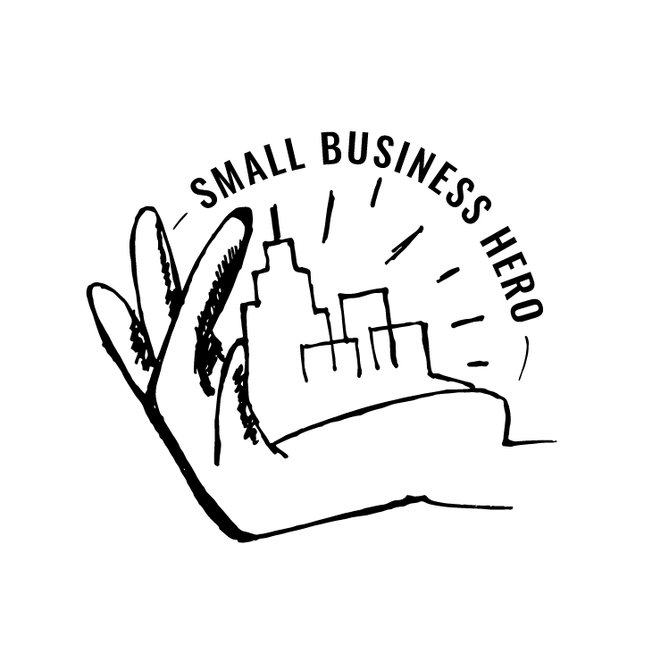

<!-- PROJECT SHIELDS -->
<!--
*** I'm using markdown "reference style" links for readability.
*** Reference links are enclosed in brackets [ ] instead of parentheses ( ).
*** See the bottom of this document for the declaration of the reference variables
*** for contributors-url, forks-url, etc. This is an optional, concise syntax you may use.
*** https://www.markdownguide.org/basic-syntax/#reference-style-links
-->
[![Contributors][contributors-shield]][contributors-url]
[![Stargazers][stars-shield]][stars-url]
[![Issues][issues-shield]][issues-url]
[](https://sonarcloud.io/dashboard?id=smallbusinesshero_dds-wvv-frontend)
[![MIT License][license-shield]][license-url]


<!-- PROJECT LOGO -->
<br />
<p align="center">
  <a href="https://github.com/smallbusinesshero/dds-wvv-frontend">
    
  </a>

  <h3 align="center">Small Business Hero</h3>

  <p align="center">
    Check out our Devpost story: <br />
    https://devpost.com/software/16_lokaleunternehmen_1605_smallbusinesshero
    <br />
    <br />
    <a href="https://github.com/smallbusinesshero/dds-wvv-frontend"><strong>Explore the docs »</strong></a>
    <br />
    <br />
    <a href="http://www.smallbusinesshero.de/">View Demo</a>
    ·
    <a href="https://github.com/smallbusinesshero/dds-wvv-frontend/issues">Report Bug</a>
    ·
    <a href="https://github.com/smallbusinesshero/dds-wvv-frontend/issues">Request Feature</a>
  </p>
</p>


<!-- TABLE OF CONTENTS -->
## Table of Contents

- [Table of Contents](#table-of-contents)
- [About The Project](#about-the-project)
  - [Built With](#built-with)
- [Getting Started](#getting-started)
  - [Prerequisites](#prerequisites)
  - [Installation](#installation)
- [Usage](#usage)
- [Roadmap](#roadmap)
- [Contributing](#contributing)
- [License](#license)
- [Contact](#contact)
- [Acknowledgements](#acknowledgements)


<!-- ABOUT THE PROJECT -->
## About The Project

[![Product Name Screen Shot][product-screenshot]](https://www.youtube.com/watch?time_continue=2&v=umg0Hjc02SM&feature=emb_logo)

### Built With

* [React](https://reactjs.org/)
* [Commerce Tools](https://commercetools.com/de/)
* [Spring Boot](https://spring.io/projects/spring-boot)


<!-- GETTING STARTED -->
## Getting Started

To get a local copy up and running follow these simple steps.

### Prerequisites

You need to install [Node.JS](https://nodejs.org/) in order develop this software.

### Installation
 
1. Clone the repo
   ```sh
   git clone https://github.com/smallbusinesshero/dds-wvv-frontend.git
   cd dds-wvv-frontend
   ```
2. Install NPM packages
   ```sh
   npm install
   ```


<!-- USAGE EXAMPLES -->
## Usage

Use this space to show useful examples of how a project can be used. Additional screenshots, code examples and demos work well in this space. You may also link to more resources.

<!-- ROADMAP -->
## Roadmap

See the [open issues](https://github.com/smallbusinesshero/dds-wvv-frontend/issues) for a list of proposed features (and known issues).


<!-- CONTRIBUTING -->
## Contributing

Contributions are what make the open source community such an amazing place to learn, inspire, and create. Any contributions you make are **greatly appreciated**.

1. Fork the Project
2. Create your Feature Branch (`git checkout -b feature/AmazingFeature`)
3. Commit your Changes (`git commit -m 'Add some AmazingFeature'`)
4. Push to the Branch (`git push origin feature/AmazingFeature`)
5. Open a Pull Request


<!-- LICENSE -->
## License

Distributed under the MIT License. See `LICENSE` for more information.


<!-- CONTACT -->
## Contact

* [Jonathan Wiens](https://www.linkedin.com/in/jonathan-wiens-022459142/)
* [Thomas Haug](https://www.linkedin.com/in/thomas-haug-931728133/)
* [Paul Boeck](https://www.linkedin.com/in/paul-boeck/)

<!-- ACKNOWLEDGEMENTS -->
## Acknowledgements

* [Anja Hendel](https://www.linkedin.com/in/anja-hendel-97921322/)
* [Jonathan Wiens](https://www.linkedin.com/in/jonathan-wiens-022459142/)
* [Thomas Haug](https://www.linkedin.com/in/thomas-haug-931728133/)
* [Katharina Schätz](https://www.linkedin.com/in/katharina-sch%C3%A4tz-3b784b131/)
* [Paul Boeck](https://www.linkedin.com/in/paul-boeck/)
* [Florencia Rodriguez](https://www.linkedin.com/in/florencia-r-816a9138/)
* [Sebastian Wohlrapp](https://www.linkedin.com/in/wohlrapp/)
* [Mehmet Arziman](https://www.linkedin.com/in/mehmet-arziman-b334bb10a/)
* [Claudia Nasenberg](https://www.linkedin.com/in/claudianasenberg/)
* [Connor Lanigan](https://www.linkedin.com/in/connorlanigan/)
* [Jannis Ötjengerdes](https://www.linkedin.com/in/jannis-%C3%B6tjengerdes-85360413b/)


<!-- MARKDOWN LINKS & IMAGES -->
<!-- https://www.markdownguide.org/basic-syntax/#reference-style-links -->
[contributors-shield]: https://img.shields.io/github/contributors/smallbusinesshero/dds-wvv-frontend.svg?style=flat-square
[contributors-url]: https://github.com/smallbusinesshero/dds-wvv-frontend/graphs/contributors
[stars-shield]: https://img.shields.io/github/stars/smallbusinesshero/dds-wvv-frontend.svg?style=flat-square
[stars-url]: https://github.com/smallbusinesshero/dds-wvv-frontend/stargazers
[issues-shield]: https://img.shields.io/github/issues/smallbusinesshero/dds-wvv-frontend.svg?style=flat-square
[issues-url]: https://github.com/smallbusinesshero/dds-wvv-frontend/issues
[license-shield]: https://img.shields.io/github/license/smallbusinesshero/dds-wvv-frontend.svg?style=flat-square
[license-url]: https://github.com/smallbusinesshero/dds-wvv-frontend/blob/master/LICENSE.txt
[product-screenshot]: preview.png
